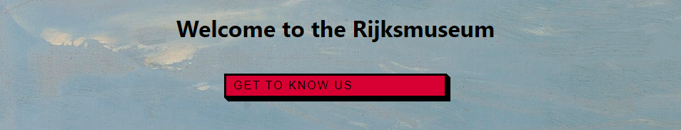

# Rijksmuseum App

### Old Description
This is was my thought process behind the development of the App

Pick of colors, theme, components, features ,setup. 
I first checked rijksmuseum website. How it was setup up visually. I loved the focus and use on images and the art it has.
I knew there that I wanted the something similar.
In my mind it would be the white background with the art. But art need to be framed, so all features would have a border. Has it was the framing.

With the background white picked the border has black, now  I need to pick a small color for buttons or other smaller components. Using the 60-20-10 rule . So I picked a small red.

Theme and colors were done. Now to features. I wanted art to visualized. So I went to research other museum websites and made a sketch with pieces from other places.

I wanted a intro feature, a navbar, the search bar and a carousel. Simple enough.

Navbar was two buttons between the logo and centered in center. Simplified and using the picked colors.

Intro feature is a simple message welcoming people and a button that could send you to another page with more info. Then I wanted to add a background for the feature. But what I did was that I added a random number through the Math.random method. It would always display a random piece of art from the museum api.

The Search, I wanted to be a simple research to display the artists works. And so it was.  Although it created a few bugs.

The carrousel is a sending a request for a random mage every 10sec.

and then a simple input request for the name and email. And the address of the Museum. hhh